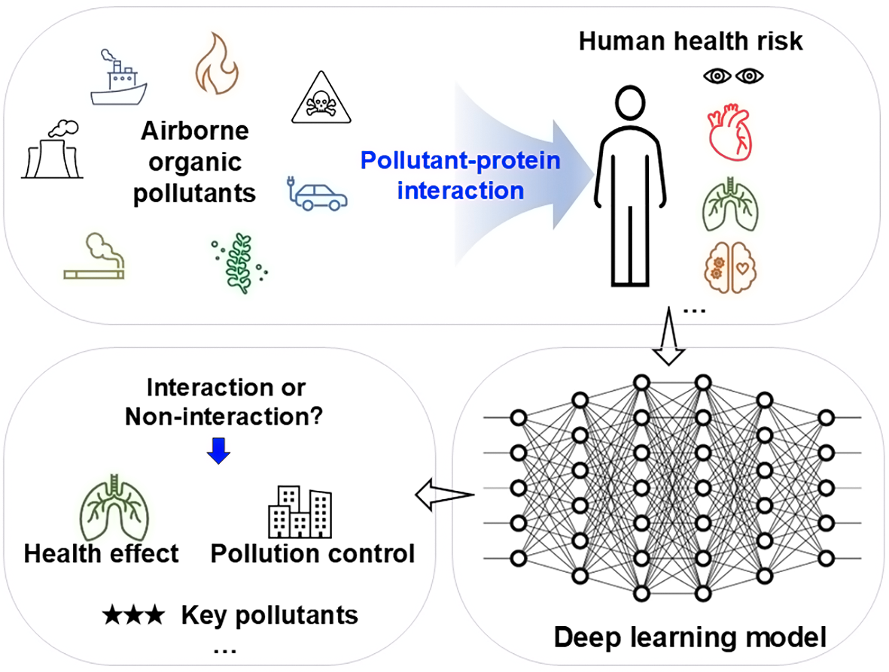

# tipFormer
A Transformer-Based Deep Learning Approach for Predicting Air Organic Pollutant-Human Protein Interactions

This project implements a TipFormer method to predict pollutant-protein interactions. It includes functions such as feature extraction using pre-trained language models, model definition, training, and prediction for new samples. The following is a detailed usage guide and an introduction to the project structure.

## Project Structure
```
.
├── feature_extractor.py  # Feature extraction using pre-trained language models
├── model.py              # Model definition
├── predict.py            # Prediction for new samples
├── best_model.pth        # Trained model weights (generated after training)
└── README.md             # This instruction file
```

## Environment Requirements
Make sure you have installed the following Python libraries:
- `torch`
- `transformers`
- `pandas`
- `numpy`
- `matplotlib`
- `sklearn`

You can install them using the following command:
```bash
pip install torch transformers pandas numpy matplotlib scikit-learn
```

## Data Preparation
The dataset used in this project can be obtained from the [T3DB database](http://www.t3db.ca) <sup>[1]</sup> and the [APDB database] (http://apdb.di.univr.it/apdb/home) <sup>[2]</sup>.

## Code Usage Instructions

### 1. Feature Extraction using Pre-trained Language Models (`feature_extractor.py`)


### 2. Model Definition (`model.py`)
Defines the structure of the `tipFormer` model, including feature encoders for chemical molecules and proteins, a cross-attention mechanism, and a prediction head.
```python
from model import TipFormer

model = tipFormer()
```

```bash
python model.py
```

### 4. Prediction for New Samples (`predict.py`)
Use the trained model to predict new SMILES strings and protein sequences.
```bash
python predict.py
```

## Notes
- Since the pre-trained models are relatively large, the model files will be automatically downloaded during the first run. Please ensure a stable network connection.
- The length of the input sequence will affect memory usage. It is recommended to adjust the `max_length` parameter according to your hardware configuration.
- The training time may be long. It is recommended to use GPU acceleration. You can add the following code to use the GPU:
```python
device = torch.device("cuda" if torch.cuda.is_available() else "cpu")
model = model.to(device)
```
And move the data to the corresponding device during data processing and model inference.

## Scalability
You can adjust the model parameters, data pre-processing flow, and evaluation metrics according to your actual needs. For example, modify the `hidden_dim` and `num_heads` parameters in `model.py`, or adjust the number of training epochs and the learning rate in `train.py`.

## Contribution
If you find any problems or have suggestions for improvement, please feel free to contact us.

## Acknowledgements

This project uses feature extraction logic inspired by / adapted from the `extract_feature.py` script in the [DTIAM](https://github.com/CSUBioGroup/DTIAM) repository (CSUBioGroup, 2023). We gratefully acknowledge their open-source contribution.

If you use this code in your research, please also consider citing the original DTIAM work:

> CSUBioGroup. (2023). *DTIAM: A unified framework for predicting drug-target interactions, binding affinities and activation/inhibition mechanisms*. GitHub repository. https://github.com/CSUBioGroup/DTIAM

## References
[1] Wishart, D.; Arndt, D.; Pon, A.; Sajed, T.; Guo, A. C.; Djoumbou, Y.; Knox, C.; Wilson, M.; Liang, Y. J.; Grant, J.; Liu, Y. F.; Goldansaz, S. A.; Rappaport, S. M. T3DB: the toxic exposome database. Nucleic Acids Res 2015, 43 (D1), D928-D934. DOI: 10.1093/nar/gku1004.
[2] Viesi, E.; Sardina, D. S.; Perricone, U.; Giugno, R. APDB: a database on air pollutant characterization and similarity prediction. Database (Oxford) 2023, 2023, baad046. DOI: 10.1093/database/baad046  From NLM.
